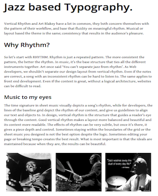

# Blakey (because I have rhythm without the blues)

### *[Roi](http://github.com/roidriscoll) and [Mervé](http://github.com/Mervodactyl)'s first foray into the visibly musical realm of Vertical Rhythm....*

Check it out at [blakey](LINK TO BE PASTED)

### TL;DR:

The point of this project is to demonstrate my understanding of Vertical Rhythm and its importance in web design.

The key to Vertical Rhythm is *readability*, and a more meaningful  layout as a result. When writing essays we are told to make sure we use paragraphs, indent our sentences and use our headings wisely so that our readers eyes wander easily over the pages we have written. Think of Vertical Rhythm as a web friendly, mathematically accurate, version of the kind of typographical neatness we are taught at school!

Technically it is a way of deciding how to size and space your letters, by dividing the baseline into equal sections and adjusting your font-size, line-height, and margin-bottom accordingly for the benefit of your readers.

Our Inspiration                                                            |  The End Product
:-------------------------------------------------------------------------:|:----------------------------------------------------------------------:
 |  

## The Story Behind the Music...

[Vertical Rhythm](http://typecast.com/blog/4-simple-steps-to-vertical-rhythm) is one of the most subtle yet powerful formats we as Front End Developers can use to create a webpage; one that is visibly (and subconciously) extremely pleasing to the eye. Yet many Developers completely ignore Vertical Rhythm because it can be difficult, annoying, and just plain boring to implement. Having come across [conflicting articles](http://www.smashingmagazine.com/2012/12/css-baseline-the-good-the-bad-and-the-ugly/) discussing its relevance within the modern web page, we decided to experiment with the baseline and come to our own conclusions as to its importance. And since this repo would be all about rhythm, we bought in one of the Jazz era's greatest to help us out: Mr [Art Blakey](http://artblakey.com/).

## Tools

* CSS
* HTML
* JavaScript ([Baseliner](http://keyes.ie/things/baseliner/))
* Meyer-Reset ([Meyer-reset](http://meyerweb.com/eric/tools/css/reset/))

## Application

First __set your font-size property to an attribute value of 100% within your body__. This is important because using 100% will mean that no matter the browser, it will ren­der­ their base font-size equal to their default (which is 16px).

If you wanted to set a lower or higher base font-size, then you would simply take the target size (for example, you wanted your base font-size to be 12px) and divide it by the actual base font-height (16px), then multiply the result by 100 to get the correct percentage:

eg: desired base font-size: 12px ==> divided by actual base font-size: 16px =>

 ```12 / 16 = 0.75``` => ```0.75 * 100 = 75``` = ```body { font-size: 75%; }```

```css

body {
  font-size: 100%; /* or 1em */
}
```
Then __choose your typographic scale, and declare font-size in ems__ (bare in mind, 1em is equal to what you declared for your base font-size, so in the above example, *__1em__(*or default font-size: 100%*) __= 16px__*. If you use the 12px example, then __1em = 12px__.

Choose your scale ==> choose a tag from your typographic scale and its corresponding font-height in pixels (h2 = 24) ==> divide it by your base font-height (16) ==> the result is the measurement in ems:

 eg: ```h1 = 32px``` => ```32 / 16 = 2 ``` => ```h1 = 2em```

The important thing is to choose a typescale, then do the calculations based around how they align to the baseline.

The typographical scale used below is the [standard](http://stackoverflow.com/questions/5410066/what-are-the-default-font-sizes-in-pixels-for-the-html-heading-tags-h1-h2) one that most browsers adhere to:

```css
p {
  font-size: 1em; /* 16 / 16 = 1 */
}

h1 {
  font-size: 2em; /* 32 / 16 = 2 */
}

h2 {
  font-size: 1.5em; /* 24 / 16 = 1.5 */
}

h3 {
  font-size:  1.3em; /* 20.8 / 16 = 1.3 */
}

h4 {
  font-size: 1em;  /* 16 / 16 = 1 */
}

h5 {
  font-size: 0.8em; /* 12.8 / 16 = 0.8 */
}

h6 {
  font-size: 0.7em; /* 11.2 / 16 = 0.7 */
}
```
Now move on to the __line-height__. The gen­eral rule of thumb for read­able text is that your line-height should be 1.4 to 1.5 times that of your font-size. Most people __use 1.5 (or rather 150%)__ it is an easier num­ber to work with math­em­at­ic­ally.

Choose a tag from your typographic scale and its corresponding font-height in pixels (p = 16) ==> times it by 150% (1.5) ==> divide the result (24) by the original font-height (16) ==> the final result is the measurement in ems:

eg: ```h1 = 32px``` => ```32 * 1.5 = 48``` => ```48 / 32 = 1.5``` = ```h1 { line-height: 1.5em; }```

```css
p {
  font-size: 1em;
  line-height: 1.5em; /* 16 * 1.5 = 24 => 24 / 16 = 1.5 */
}

h1 {
  font-size: 2em;
  line-height: 1.5em; /* 32 * 1.5 = 48 => 48 / 32 = 1.5 */
}

h2 {
  font-size: 1.5em;
  line-height: 1.5em; /* 24 * 1.5 = 36 => 36 / 24 = 1.5 */
}

h3 {
  font-size:  1.3em;
  line-height: 1.5em; /* 20.8 * 1.5 = 31.2 => 31.2 / 20.8 = 1.5 */
}

h4 {
  font-size: 1em;
  line-height: 1.5em; /* 16 * 1.5 = 24 => 24 / 16 = 1.5 */
}

h5 {
  font-size: 0.8em;
  line-height: 1.5em; /* 12.8 * 1.5 = 19.2 => 19.2 / 12.8 = 1.5 */
}

h6 {
  font-size: 0.7em;
  line-height: 1.5em; /* 11.2 * 1.5 = 16.8 => 16.8 / 11.2 = 1.5 */
}
```
Finally calculate the __margin-bottom__. Most developers use the same calculations for the margin-bottom as they used for line-height with the exception that ```h1``` and ```h2``` may have half values, it depends on your preference really and the overall look of your web page:

```css
p {
  font-size: 1em;
  line-height: 1.5em;
  margin-bottom: 0.75em; /* 1.5 / 2 = 0.75 */
}

h1 {
  font-size: 2em;
  line-height: 1.5em;
  margin-bottom: 0.75em; /* 1.5 / 2 = 0.75 */
}

h2 {
  font-size: 1.5em;
  line-height: 1.5em;
  margin-bottom: 1.5em;
}

h3 {
  font-size:  1.3em;
  line-height: 1.5em;
  margin-bottom: 1.5em;
}

h4 {
  font-size: 1em;
  line-height: 1.5em;
  margin-bottom: 1.5em;
}

h5 {
  font-size: 0.8em;
  line-height: 1.5em;
  margin-bottom: 1.5em;
}

h6 {
  font-size: 0.7em;
  line-height: 1.5em;
  margin-bottom: 1.5em;
}
```
And thats it!

It can be quite a chal­lenge work­ing with __ems__ but the pay-off is a well coded, access­ible and respons­ive site.

It is crucial to understand the reasoning and maths behind Vertical Rhythm before any shortcuts are taken - such as online Grid calculators or pre-made font-size tables. Vertical Rhythm is not perfect, and you may still have to manually adjust the margins etc somewhat depending on your layout, but the overall effect for your readers will be worth the effort!

## Mistakes made and learned from

[Normalise.css](https://necolas.github.io/normalize.css/) was not compatible within the confines of Vertical Rhythm and the [Baseliner Tool](http://keyes.ie/things/baseliner/) we decided to include for clarity, therefore we choose to use a  [Meyer-reset](http://meyerweb.com/eric/tools/css/reset/) instead.

Since the key to Vertical Rhythm is that __all elements must take up a height of ( n * base line-height ) where 'n' is an integer value__, *SASS mixins* would have been ideal for calculating the necessary font-sizes and line-heights.

Setting the body to ```{ font-size: 100%; }``` means that the browser will automatically render the font to its default font-size (usually 16px).

Despite the best intensions, unless you are working with only one text size its rare for a page to have flawless Vertical Rhythm, so improvisation will often occur.

## Conclusion

I think typographer __Robert Bringhurst__ sums up my final thoughts on the matter best:

> “Space in typography is like time in music. It is infinitely divisible, but a few proportional intervals can be much more useful than a limitless choice of arbitrary quantities.”
